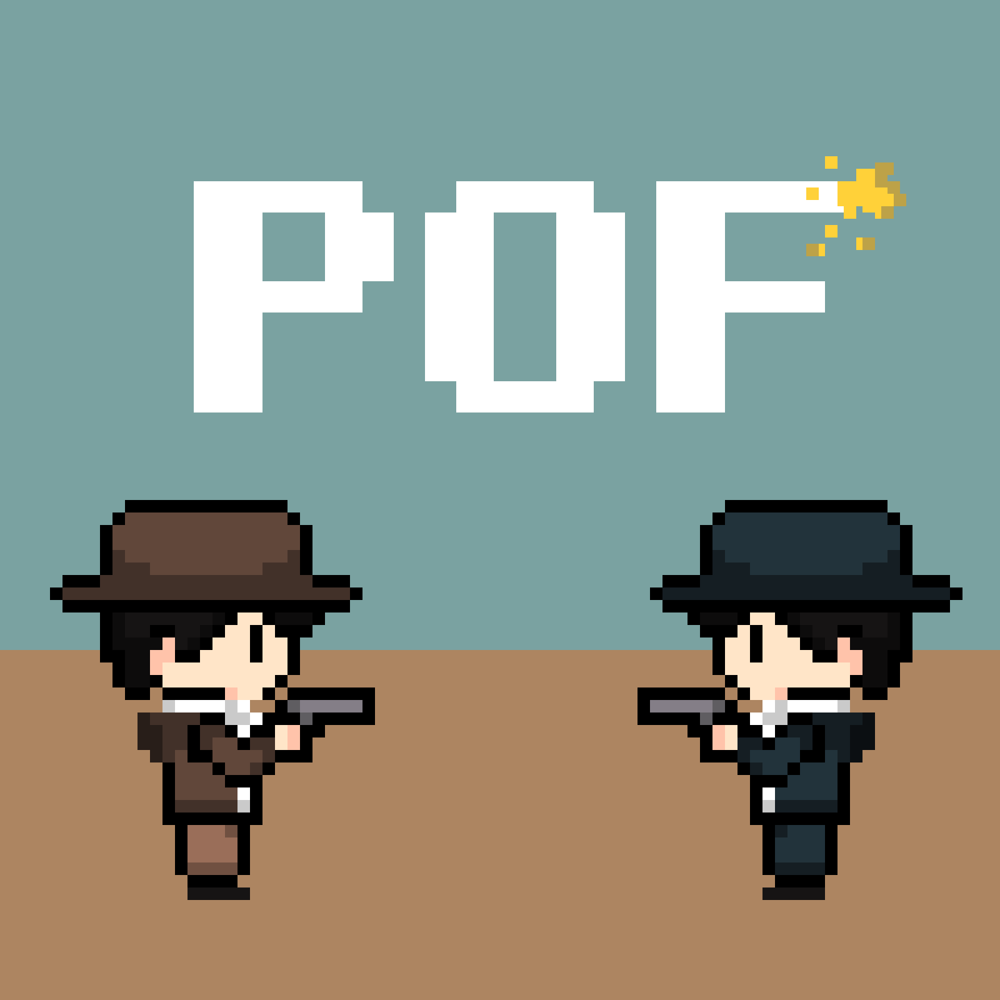
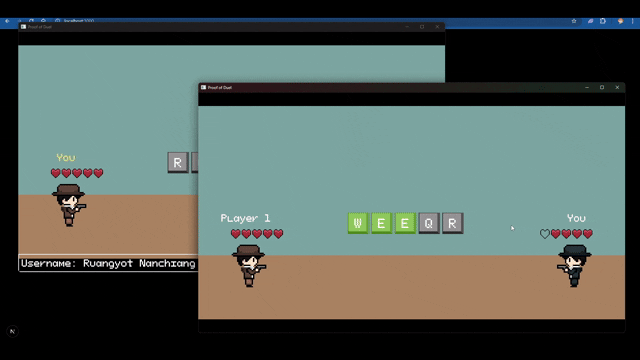
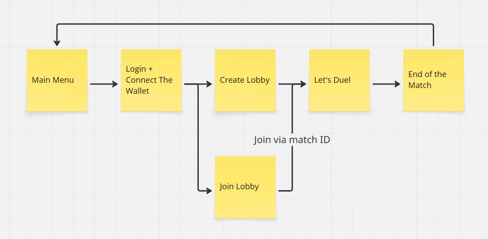

# Proof of Duel 🔫

**Author:** Ruangyot Nanchiang  
**Demo:** [YouTube](https://www.youtube.com/watch?v=jYE64huwxVU)  
**Play (No Solana Integration, Password: proof_456):** [Itch.io](https://rayato159.itch.io/proof-of-duel)

## 📑 Overview

**Proof of Duel** is a multiplayer PvP rhythm-combo shooting game where players must press keys shown on-screen to deal damage to opponents. Win/loss stats are recorded on the **Solana blockchain**.

## ⛷️Theme & Story

Inspired by _Patapon_, reimagined as a **real-time cowboy duel**. Two gunslingers face off speed and precision determine the winner.

## 🎲 Genre

Competitive rhythm-combo shooting, similar to _Patapon_ and _Osu!_.

## 🎯 Core Gameplay Loop

1. Login & connect wallet (Civic Auth + Solana).
2. Create or join a match via Match ID.
3. Countdown 3-2-1 → Duel begins.
4. Press correct key combos to deal damage (5 HP per player).
5. Match ends when one player’s HP reaches zero.

## 🧩 Features

- Solana wallet login & KYC
- Matchmaking via Match ID
- Real-time rhythm-combo combat
- Win/loss stats recorded on-chain
- Planned NFT & coin drops, marketplace, and elemental system

## 🛣️ Roadmap

**Phase 1:** Matchmaking + on-chain stats  
**Phase 2:** Random matchmaking, ranking dashboard  
**Phase 3:** NFT/Coin drops, marketplace  
**Phase N:** Elemental system for bullets & armor

## 🔨 Tech Stack
- **Game Engine:** Bevy
- **Solana Program:** Solana Anchor
- **Authentication:** Civic Auth
- **Frontend:** NextJS
- **Music:** FL Studio
- **Pixel Art:** Aseprite

## 📜 License
This project is licensed under the MIT License. See the [LICENSE](./LICENSE) file for details.

## 👀 Game Design Document
For a detailed game design document, see [ProofOfDuelGDD.pdf](./ProofOfDuelGDD.pdf).
